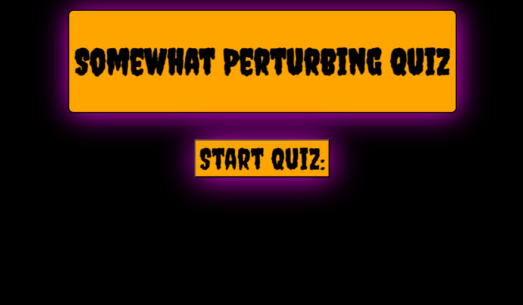
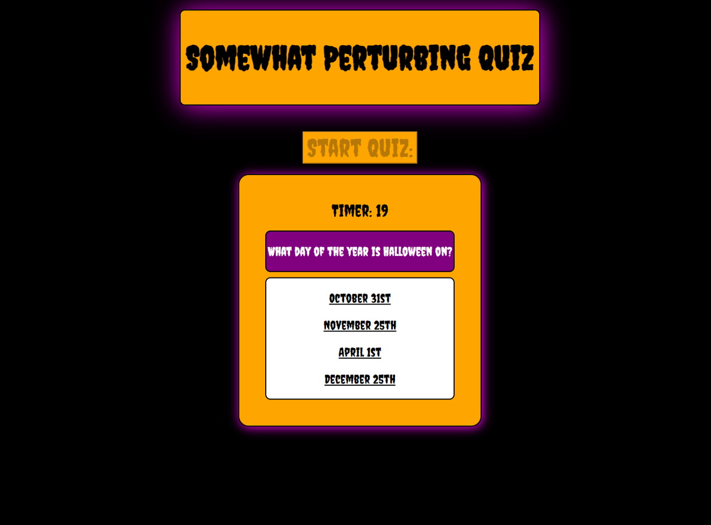
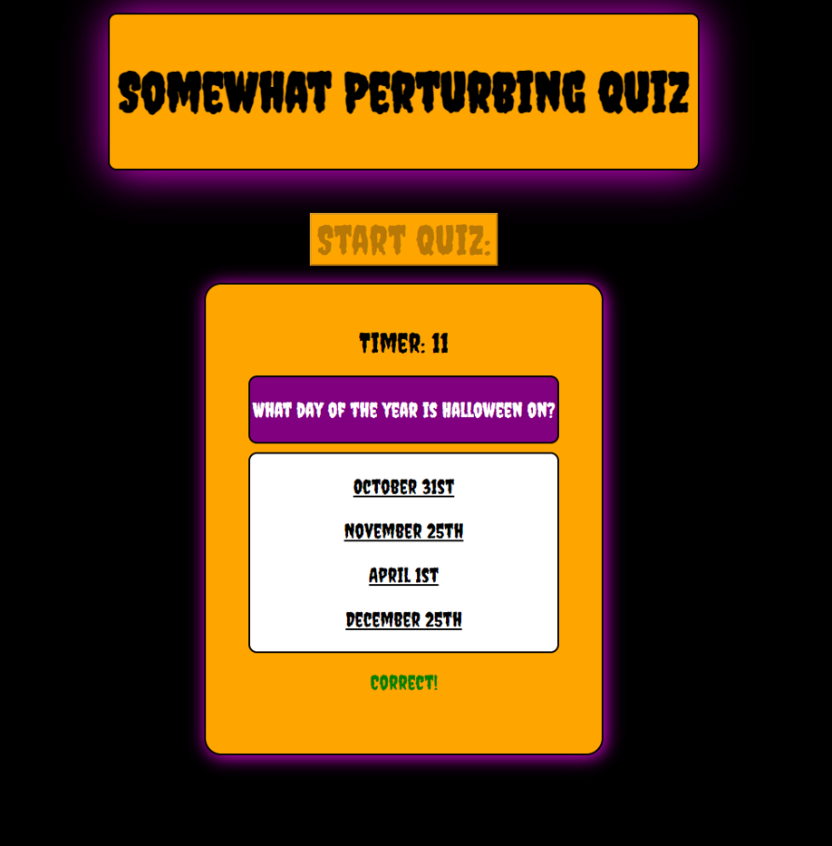
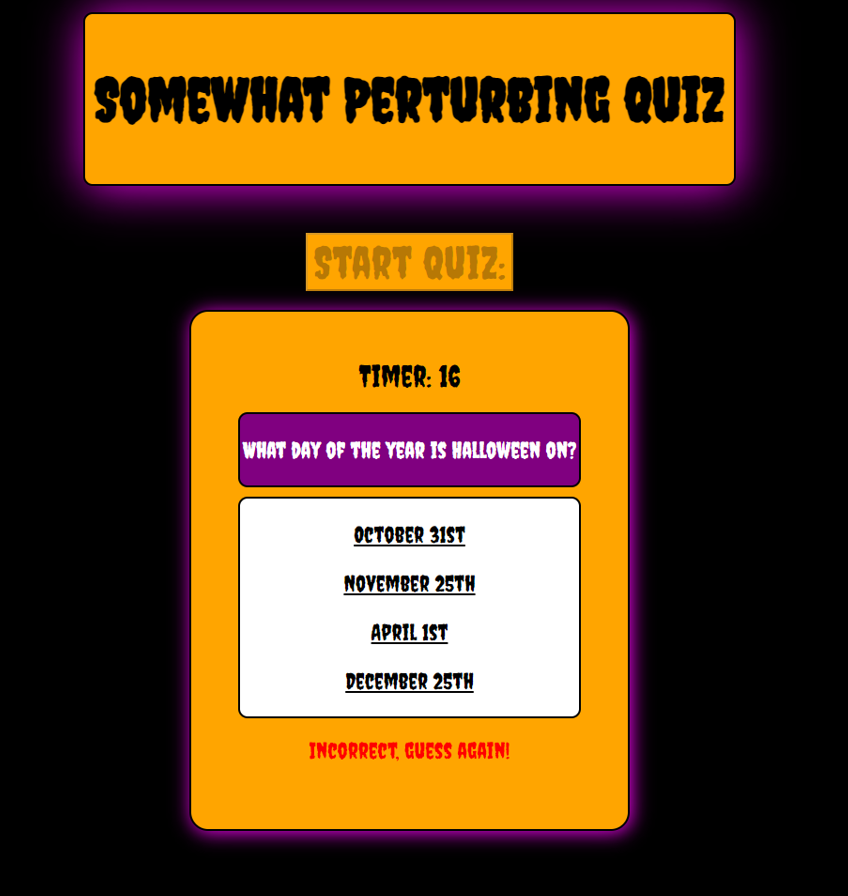
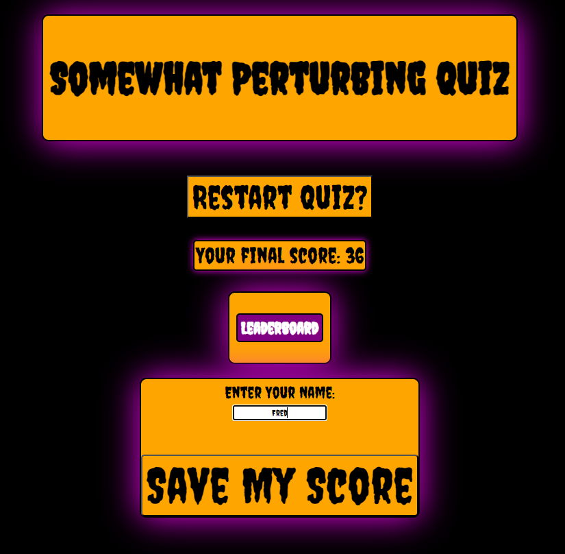
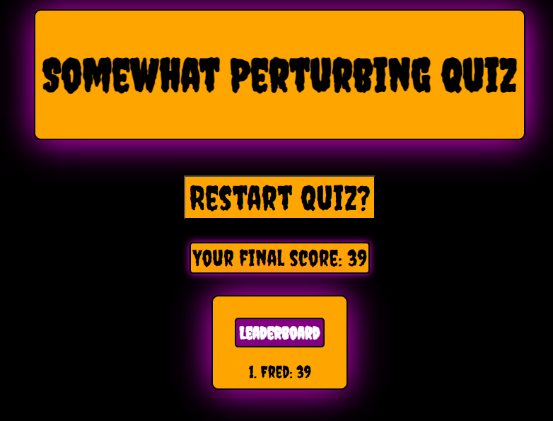

# quiz-game

## Description

This project is a small quiz made mostly using HTML, CSS, and JavaScript. The quiz is a short quiz about some Halloween facts, and maybe something slightly more insidious.

## Installation

The application should run perfectly within any modern browser.

Link to application: 
https://fspaghetti3.github.io/quiz-game/

## Usage

Click the start button in order to begin the quiz. There will be 4 questions displayed within a white text box, clicking on the wrong answer will prompt "Incorrect", and a correct answer will prompt "Correct!", and move onto the next set of questions.

Each question answered correctly will add +5 seconds to the timer,

At the end, a leaderboard will display, with the option to enter a name so you can log you score to your local leaderboard!

If a correct answer is selected:

If an incorrect answer is selected:

Pictures of the leaderboard function:

## Credits

CHill-Three: https://github.com/CHill-Three
README Guide: https://coding-boot-camp.github.io/full-stack/github/professional-readme-guide
SimpleStepsCode: https://simplestepscode.com/javascript-quiz-tutorial/
